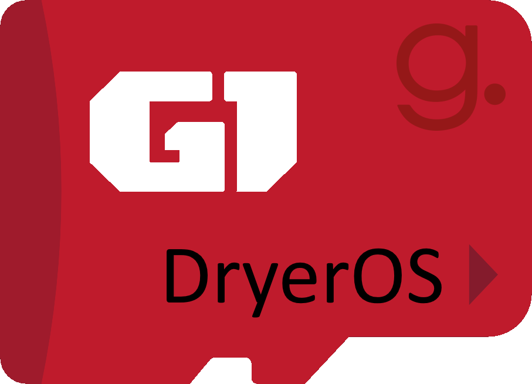

# Ginger Dryer

**Ginger Dryer** is a comprehensive solution for managing the drying process of plastic pellets. This system is built on a Raspberry Pi provide precise control and a responsive web interface.

Our operating system image is based on **Raspberry Pi OS**, the official and well-supported distribution for Raspberry Pi.

Each image comes with all the necessary software pre-installed and configured. This lets you focus on drying your pellets right away without the hassle of a complex initial setup. For a complete list of what's included, see the **Features & Components** section below.